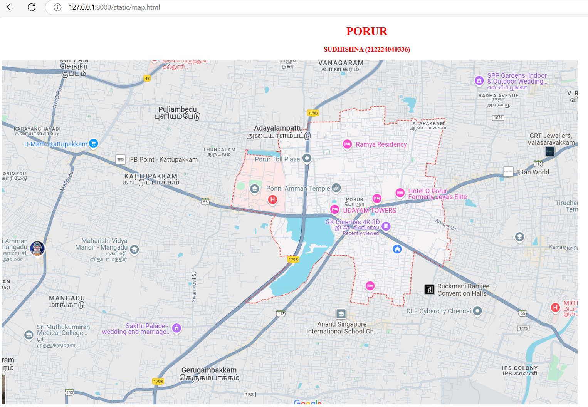

# Ex04 Places Around Me
## Date: 25.04.2025

## AIM
To develop a website to display details about the places around my house.

## DESIGN STEPS

### STEP 1
Create a Django admin interface.

### STEP 2
Download your city map from Google.

### STEP 3
Using ```<map>``` tag name the map.

### STEP 4
Create clickable regions in the image using ```<area>``` tag.

### STEP 5
Write HTML programs for all the regions identified.

### STEP 6
Execute the programs and publish them.

## CODE
```
<!DOCTYPE html>
<html lang="en">
<head>
    <meta charset="UTF-8">
    <meta name="viewport" content="width=device-width, initial-scale=1.0">
    <title>My City</title>
</head>
<body>
 <center>
    <h1 style="color:red">PORUR</h1>
    <h3 style="color:red">SUDHISHNA (212224040336)</h3>
 </center>   
     <!-- Image Map Generated by http://www.image-map.net/ -->


<map name="image-map">
    <area target="" alt="college" title="college" href="college.html" coords="156,767,99" shape="circle">
    <area target="" alt="dmart" title="dmart" href="dmart.html" coords="135,221,125" shape="circle">
    <area target="" alt="theatre" title="theatre" href="theatre.html" coords="979,469,117" shape="circle">
    <area target="" alt="school" title="school" href="school.html" coords="927,734,98" shape="circle">
    <area target="" alt="grt" title="grt" href="grt.html" coords="1502,225,85" shape="circle">
</map>
</center>
</body>
</html>

college.html

<html>
<head>
<title>My Home Town</title>
</head>
<body bgcolor="skyblue">
<h1 align="center">
<font color="purple"><b>MANGADU</b></font>
</h1>
<h3 align="center">
<font color="blue"><b>SRI MUTHUKUMARAN MEDICAL COLLEGE</b></font>
</h3>
<hr size="3" color="white">
<p align="justify">
<font face="Georgia" size="5">
    College is a significant phase in a student’s life that bridges the gap between school education and the professional world. It is a place where students gain not only academic knowledge but also essential life skills, independence, and exposure to diverse cultures and ideas. College life encourages personal growth, critical thinking, and creativity through various academic and extracurricular activities. It also plays a key role in shaping one’s career path and building lifelong friendships. For many, college is a journey of self-discovery and the foundation for a successful future.
</p>
</body>
</html>

dmart.html
grt.html
<html>
<head>
<title>My Home Town</title>
</head>
<body bgcolor="skyblue">
<h1 align="center">
<font color="purple"><b>KATTUPAKKAM</b></font>
</h1>
<h3 align="center">
<font color="blue"><b>DMART</b></font>
</h3>
<hr size="3" color="white">
<p align="justify">
<font face="Georgia" size="5">
    DMart is one of India’s leading supermarket chains, known for offering a wide range of quality products at affordable prices. Founded by Radhakishan Damani, DMart has become a trusted name among shoppers for groceries, household essentials, clothing, kitchenware, and more. Its stores are well-organized, spacious, and customer-friendly, making the shopping experience quick and convenient. With a focus on savings and value for money, DMart continues to be a favorite destination for millions of Indian families.

</p>
</body>
</html>

theatre.html
grt.html
<html>
<head>
<title>My Home Town</title>
</head>
<body bgcolor="skyblue">
<h1 align="center">
<font color="purple"><b>PORUR</b></font>
</h1>
<h3 align="center">
<font color="blue"><b>GK CINEMAS 4K 3D</b></font>
</h3>
<hr size="3" color="white">
<p align="justify">
<font face="Georgia" size="5">
    GK Cinemas 4K 3D is a popular movie theatre known for delivering a premium cinematic experience. Equipped with advanced 4K projection and immersive 3D technology, it offers crystal-clear visuals and high-quality sound that truly bring movies to life. Located in Chennai, GK Cinemas is a favorite among movie lovers for its comfortable seating, well-maintained facilities, and a wide selection of films ranging from Tamil blockbusters to international releases. Whether you're watching a thrilling action film or a heartwarming drama, GK Cinemas ensures an unforgettable viewing experience.
</p>
</body>
</html>

school.html
<html>
<head>
<title>My Home Town</title>
</head>
<body bgcolor="black">
<h1 align="center">
<font color="white"><b>CHENNAI</b></font>
</h1>
<h3 align="center">
<font color="white"><b>ANAND SINGAPORE INTERNATIONAL SCHOOL</b></font>
</h3>
<hr size="3" color="red">
<p align="justify">
<font face="Georgia" size="5 " font color="white">
    Anand Singapore International School (ASIS) is a reputed institution known for offering world-class education by combining the Singapore curriculum with modern teaching methods. The school focuses on holistic development, encouraging students to excel not only in academics but also in creativity, leadership, and character building. With a strong emphasis on innovation, global awareness, and personal growth, ASIS creates a nurturing environment where students are inspired to become confident, responsible, and future-ready individuals. Its dedicated faculty, advanced infrastructure, and student-friendly approach make it a preferred choice for parents seeking international-quality education.
    
</p>
</body>
</html>

grt.html

grt.html
<html>
<head>
<title>My Home Town</title>
</head>
<body bgcolor="skyblue">
<h1 align="center">
<font color="purple"><b>VALASARAVAKKAM</b></font>
</h1>
<h3 align="center">
<font color="blue"><b>GRT</b></font>
</h3>
<hr size="3" color="white">
<p align="justify">
<font face="Georgia" size="5">
  GRT Jewellers, officially known as G.R. Thanga Maligai, is a renowned jewellery brand headquartered in Chennai, Tamil Nadu. Established in 1964 by Shri G. Rajendran, it began as a modest store in T. Nagar and has grown into one of India's most trusted jewellery houses, celebrated for its commitment to purity, craftsmanship, and customer satisfaction. 
</p>
</body>
</html>

```

## OUTPUT



## RESULT
The program for implementing image maps using HTML is executed successfully.
